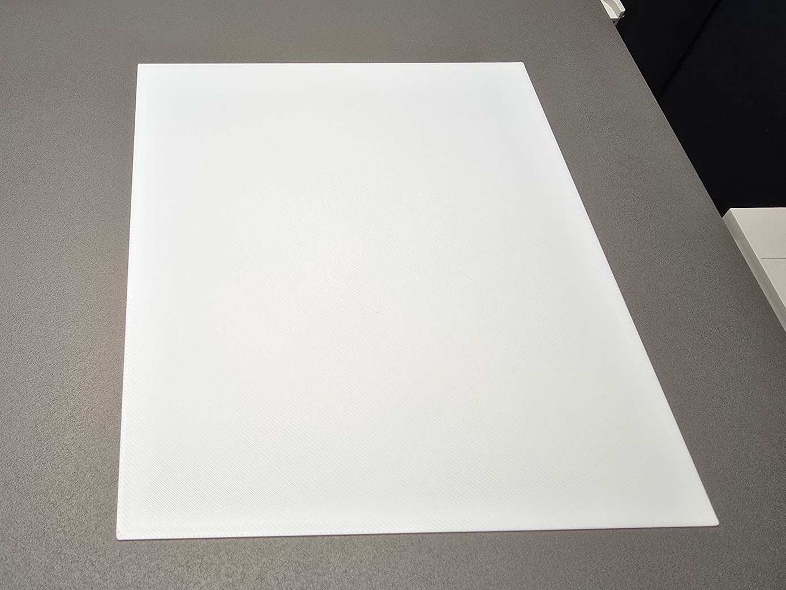
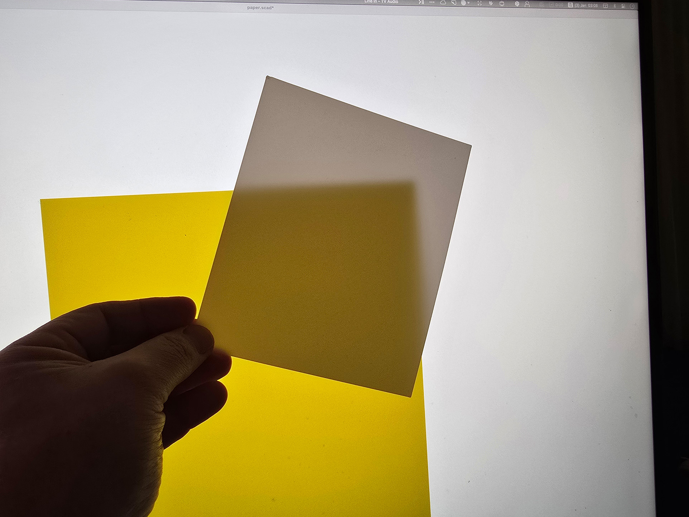

# Generate paper

Generate paper-like thin sheets by presets or your custom dimensions.

## Presets

- DIN A0
- DIN A1
- DIN A2
- DIN A3
- DIN A4
- DIN A5
- DIN A6
- DIN A7
- DIN A8
- DIN A9
- DIN A10
- DIN B0
- JIS B0
- DIN B1
- JIS B1
- DIN B2
- JIS B2
- DIN B3
- JIS B3
- DIN B4
- JIS B4
- DIN B5
- JIS B5
- DIN B6
- JIS B6
- DIN B7
- JIS B7
- DIN B8
- JIS B8
- DIN B9
- JIS B9
- DIN B10
- JIS B10
- Invoice
- Executive
- Legal
- ANSI A (Letter)
- ANSI B (Ledger, Tabloid)
- ANSI C (Broadsheet)
- ANSI D
- ANSI E
- ANSI F
- P6
- P5
- P4
- P3
- P2
- P1

## Special preset

[Cozy Lotus Shoji Lamp](https://makerworld.com/en/models/909252):

- Shoji Lamp (Side)
- Shoji Lamp (Top)

Build Plate Cleaner:

- Bambu Lab P1, X1, A1
- Bambu Lab A1 Mini
